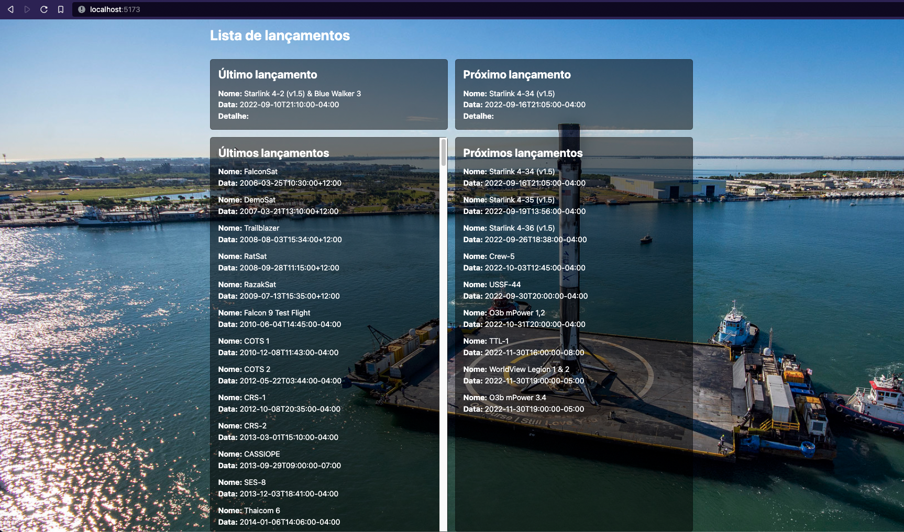
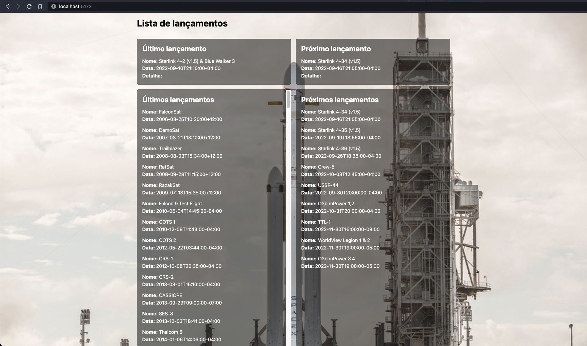
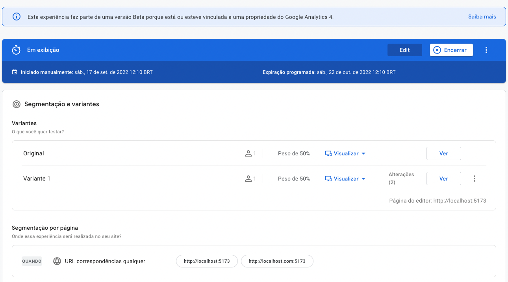

# **Projeto do Desafio - Space X + teste A/B**

Este projeto mostra os lançamentos de foguetes da Space X. Há 4 infomações. Último lançamento, próximo lançamento, últimos lançamentos e próximos lançamentos.

A API pega estas infomações de uma rota externa e devolve um objeto ou uma lista de objetos com as informações.
- Repositório utilizado : [SpaceX-API](https://github.com/r-spacex/SpaceX-API/tree/master/docs/launches/v4)

O CLIENT consome a API e monta 4 cards com as respectivas informações numa única página. Também há um teste A/B onde as variações são a imagem de background e a cor do título são alterados
<br>
<br>
## **API**

- Linguagem: Nodejs + Typescript
- Detalhes: Foi usada a estrutura orientada por dominio e testes unitários automatizados, injeção de dependências e arquitetura limpa.
- Para executar o projeto siga os seguintes passos:

```
git pull
cd /api
yarn ou npm i
npx nodemon src/main.ts
```

### **Rotas disponíveis**
<br>

  Method | Rota | Retorno
:-------:|------|--------
GET | http://localhost:3000/launches/last | Launch (object)
GET | http://localhost:3000/launches/past | Launch[] (array)
GET | http://localhost:3000/launches/next | Launch (object)
GET | http://localhost:3000/launches/upcoming | Launch[] (array)
<br>

### Pontos a serem melhorados

- Adicionar arquivo de variaveis de ambiente e colocar as urls e outras configurações para remover do codigo e do git

<br>
<br>

## **CLIENTE**

- Linguagem: ReactJs + Typescript
- Detalhes: Foi usado ReactJs como framework,o Vite como compilador e Tailwind CSS para a estilização. Para o teste A/B foi utilizado o Google Optimize. A estrutura usada foi seguindo os mesmos conceitos da API.
- Para executar o projeto siga os seguintes passos:

```
git pull
cd /client
yarn ou npm i
yarn dev
```

<br>

### Rota
> http://localhost:5173


<br>
<br>

## **Teste A/B**

Screenshot página original


Screenshot página variação 1


Screenshot painel do google optimize


### Pontos a serem melhorados
 - Criar testes automatizados;
 - Adicionar arquivo de variaveis de ambiente e colocar as urls e outras configurações para remover do codigo e do git
 - Melhorar a injeção de dependências usando contexto ou alguma outra forma que o React forneça;